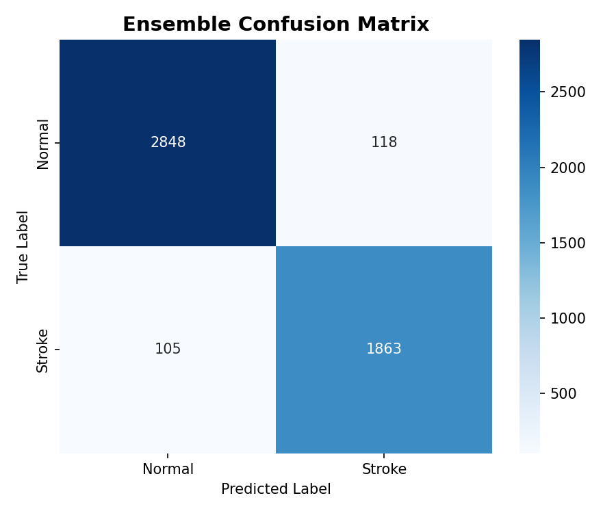

# 🧠 Brain Stroke Detection Using MRI/CT Scan

<p align="center">
  
  
  
  
  
</p>

> **3rd Year Engineering Project** — A deep-learning pipeline that classifies brain MRI/CT scans as **Normal** or **Stroke** using an ensemble of VGG19 and EfficientNetB4 models, achieving **95% accuracy**.

---

## 📌 Table of Contents

- [Overview](#-overview)
- [Demo & Results](#-demo--results)
- [Dataset](#-dataset)
- [Model Architecture](#-model-architecture)
- [Project Structure](#-project-structure)
- [Getting Started](#-getting-started)
- [Results](#-results)
- [Making the Project Live](#-making-the-project-live)
- [Future Work](#-future-work)
- [License](#-license)

---

## 🔍 Overview

Stroke is one of the leading causes of death and disability worldwide. Early and accurate detection through brain imaging (MRI/CT) is critical for timely treatment. This project automates stroke detection using **transfer learning** and an **ensemble of two state-of-the-art CNNs**.

### Key Highlights
- ✅ Binary classification: **Stroke** vs **Normal**
- ✅ Ensemble of **VGG19** (weight 0.55) + **EfficientNetB4** (weight 0.45)
- ✅ Data augmentation to improve generalization
- ✅ **95% overall accuracy** on 4,934 test samples
- ✅ 96% precision & recall on Normal class | 94% on Stroke class

---

## 🖼️ Demo & Results

### Confusion Matrix


### Classification Report

| Class    | Precision | Recall | F1-Score | Support |
|----------|-----------|--------|----------|---------|
| Normal   | 0.96      | 0.96   | 0.96     | 2,966   |
| Stroke   | 0.94      | 0.95   | 0.94     | 1,968   |
| **Accuracy** |       |        | **0.95** | 4,934   |
| Macro Avg | 0.95    | 0.95   | 0.95     | 4,934   |
| Weighted Avg | 0.95 | 0.95  | 0.95     | 4,934   |

**Ensemble Weights → VGG19: 0.55 | EfficientNetB4: 0.45**

---

## 📂 Dataset

The dataset is organized into two classes:

```
dataset/
├── Normal/     # Brain scans with no stroke
└── Stroke/     # Brain scans with stroke detected
```

> ⚠️ **Note:** The dataset is NOT included in this repository due to its large size.  
> 📥 You can download the dataset from: *(add your Kaggle/Google Drive link here)*

---

## 🏗️ Model Architecture

The system uses a **weighted ensemble** of two pretrained CNN backbones:

```
Input Image (224×224 or model-specific size)
       │
       ├──── VGG19 (Fine-tuned) ──── Dense Head ──── Softmax
       │            weight: 0.55
       │
       └──── EfficientNetB4 (Fine-tuned) ──── Dense Head ──── Softmax
                    weight: 0.45
                         │
                  Weighted Average
                         │
                  Final Prediction
              (Normal / Stroke)
```

### Training Strategy
- **Phase 1**: Train only the custom classification head (frozen backbone)
- **Phase 2**: Fine-tune the full model (unfrozen backbone) with a lower learning rate
- Checkpoints saved as `eff_p1.keras`, `eff_final.keras`, `vgg19_p1.keras`, `vgg19_final.keras`

---

## 📁 Project Structure

```
StrokeDetection/
│
├── StrokeDetection.ipynb      # Main Jupyter Notebook (full pipeline)
│
├── models/
│   ├── vgg19_p1.keras         # VGG19 — Phase 1 checkpoint
│   ├── vgg19_final.keras      # VGG19 — Final trained model
│   ├── eff_p1.keras           # EfficientNetB4 — Phase 1 checkpoint
│   ├── eff_final.keras        # EfficientNetB4 — Final trained model
│   └── ensemble_weights.json  # Optimal ensemble weights
│
├── graphs/
│   ├── confusion_matrix.png   # Confusion matrix visualization
│   └── classification_report.txt  # Detailed performance metrics
│
├── dataset/                   # (not tracked — see Dataset section)
│   ├── Normal/
│   └── Stroke/
│
├── .gitignore
└── README.md
```

---

## 🚀 Getting Started

### Prerequisites

```bash
Python >= 3.9
TensorFlow >= 2.10
Keras
NumPy
Matplotlib
scikit-learn
Pillow
```

### Installation

```bash
# 1. Clone the repository
git clone https://github.com/<your-username>/StrokeDetection.git
cd StrokeDetection

# 2. (Optional) Create a virtual environment
python -m venv venv
venv\Scripts\activate        # Windows
# source venv/bin/activate   # Linux / macOS

# 3. Install dependencies
pip install tensorflow keras numpy matplotlib scikit-learn pillow jupyter
```

### Running the Notebook

```bash
jupyter notebook StrokeDetection.ipynb
```

> Make sure the `dataset/` folder is in place before running training cells.

### Running Inference Only (with saved models)

The final models are available in the `models/` folder. Load them directly:

```python
import tensorflow as tf
import json, numpy as np
from PIL import Image

# Load models
vgg   = tf.keras.models.load_model('models/vgg19_final.keras')
effnet = tf.keras.models.load_model('models/eff_final.keras')

# Load ensemble weights
with open('models/ensemble_weights.json') as f:
    weights = json.load(f)   # {'vgg19': 0.55, 'efficientnet': 0.45}

# Preprocess a scan image
img = Image.open('your_scan.png').resize((224, 224))
arr = np.expand_dims(np.array(img) / 255.0, axis=0)

# Ensemble prediction
pred = weights['vgg19'] * vgg.predict(arr) + weights['efficientnet'] * effnet.predict(arr)
label = 'Stroke' if np.argmax(pred) == 1 else 'Normal'
print(f'Prediction: {label}')
```

---

## 📊 Results

| Model            | Accuracy |
|------------------|----------|
| VGG19 (alone)    | ~93%     |
| EfficientNetB4 (alone) | ~93% |
| **Ensemble (weighted)** | **95%** |

The weighted ensemble consistently outperforms individual models.

---

## 🌐 Making the Project Live

There are several free options to deploy this project online so anyone can upload a scan and get a prediction:

### Option 1 — Streamlit Cloud *(Easiest — Recommended)*
1. Create a `app.py` Streamlit app wrapping the model inference
2. Push to GitHub
3. Go to [streamlit.io/cloud](https://streamlit.io/cloud) → **Deploy from GitHub** → free hosting!

### Option 2 — Hugging Face Spaces *(Free GPU support)*
1. Create an account on [huggingface.co](https://huggingface.co)
2. Create a new **Space** with Gradio or Streamlit SDK
3. Upload your model + inference script — instantly live!

### Option 3 — Google Colab + ngrok *(Quick demo)*
- Run the notebook on Colab and expose a public URL via `pyngrok`

### Option 4 — Render / Railway *(Flask/FastAPI backend)*
- Build a Flask REST API around the model and deploy for free on Render

---

## 🔮 Future Work

- [ ] Add Grad-CAM visualizations to highlight stroke regions
- [ ] Support DICOM format (raw MRI/CT files)
- [ ] Build a Streamlit / Gradio web app for live predictions
- [ ] Extend to multi-class stroke type classification
- [ ] Integrate clinical patient metadata for improved accuracy
- [ ] Mobile app deployment (TensorFlow Lite)

---

## 👨‍💻 Author

**[Your Name]**  
3rd Year B.E. / B.Tech — Computer Science / AI & ML  
[Your College Name]

---

## 📄 License

This project is licensed under the **MIT License** — see the [LICENSE](LICENSE) file for details.

---

<p align="center">
  Made with ❤️ as a 3rd Year Project
</p>
